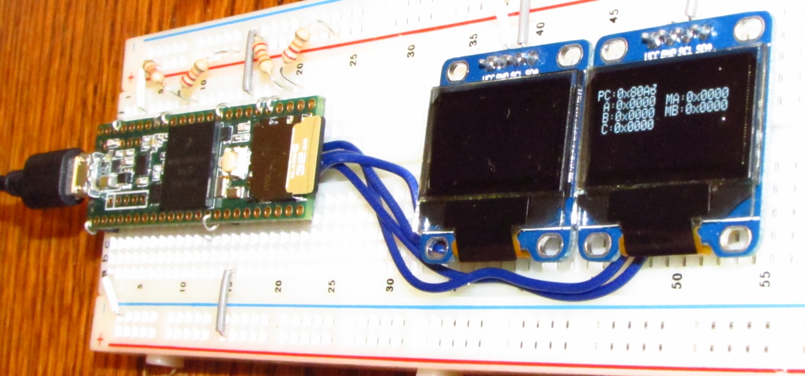

# Single-Instruction-Set Computer VM for Teensy 3.6

The Single-Instruction-Set Computer (**SISC**) is a CPU and associated Von Neuman architecture that has only has only a single instruction: Subtract and Branch if Negative (**SBN**). SISC is a turing-complete architecture, although it relies heavily on self-modifying code to achieve common operations such as dereferencing a pointer.

This SISC VM is implemented for use on a [Teensy 3.6](https://www.adafruit.com/product/3266) microcontroller, with dual OLED displays over i2c.



## Specifications

SISC as implemented has a 16-bit address space with 16-bit words.

Word bits are `0` through `15` inclusive, where bit `15` is the most-significant bit.

Negative numbers are not represented; all words are positive.  However, for purposes of subtraction, negatives are represented as if they were the bottom 16 bits of a twos-complement integer.

Instruction format:

```
SBN A, B, C
	Subtract and Branch if Negative
	
	MA = Mem[A]
	MB = Mem[B]
	NEG = MB > MA
	Mem[A] = MA - MB
	If NEG
		PC = C
	Else
		PC = PC+3

SBN A, B
	Subtract and Proceed

	This is interpreted as: SBN A, B, $(PC + 3)

	This version of the SBN instruction is only possible via intervention
	of a linker, which substitutes the linked address of the next
	instruction for the unsupplied C argument in each instance of this
	instruction.
```

No registers are directly available to programs, however `PC` is memory-mapped to address `0xFFFF`.  When reading or writing to the memory-mapped `PC`, memory access is performed prior to branching.  Specifically, for non-negative subtractions, the value of `PC` as modified by the current instruction is used when computing `(PC+3)`.

All devices, including I/O devices, are memory-mapped.

## List of Specification Documents

*	[Hardware configuration](teensy-hardware.md)
*	[Memory-mapped hardware addresses](hardware.md)
*	[Compiled object file format](object-file-format.md)
*	[Assembly language format](assembly-language-format.md)
*	[List of examples](example)

## Noteworthy SBN Examples

*	[Dereference a pointer](example/dereference-pointer.md)
*	[Write zero-terminated string to serial console](example/write-string-to-console.md)


